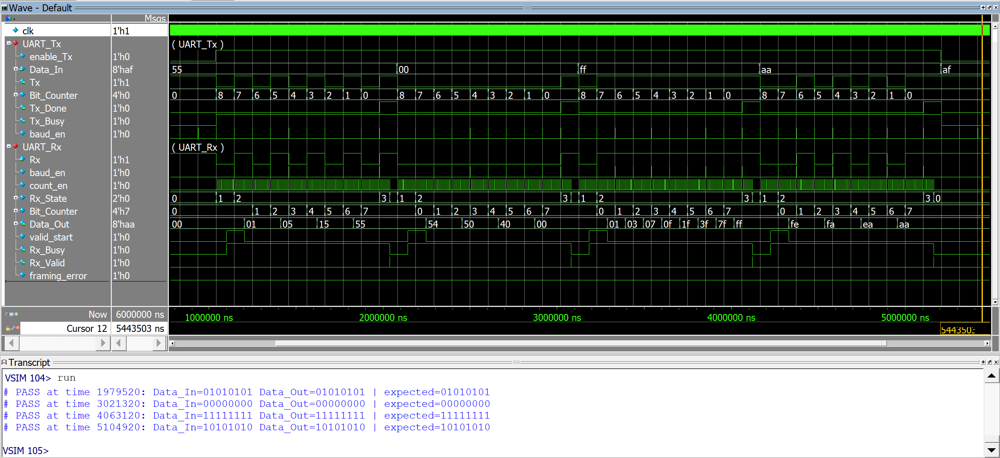

# UART Tx/Rx in Verilog (Robust Implementation)

## 📌 Overview

This project implements a UART (Universal Asynchronous Receiver/Transmitter) in Verilog, including both Transmitter (Tx) and **Receiver (Rx)** modules.

The design focuses not only on functionality but also on **robustness and real-world reliability**, using techniques like oversampling, majority voting, and error detection.

---

## ⚙️ Features

### Receiver (Rx)

* 16× oversampling for accurate bit detection
* Majority voting (samples 7, 8, 9) to reduce noise impact
* Start-bit validation to reject false triggers
* Framing error detection (invalid stop bit)
* Handles continuous/back-to-back data frames
* Synchronization using double flip-flop (metastability protection)

### Transmitter (Tx)

* Serial data transmission (LSB first)
* Start and stop bit generation
* Busy and done signal handling

---

## 🧠 Design Approach

### Oversampling
The receiver samples each bit at **16× the baud rate**, allowing:

* Better timing alignment
* Improved tolerance to baud mismatch
* Noise resilience

### Majority Voting

Instead of sampling once, 3 samples are taken around the center of the bit => Samples: 7, 8, 9 → Majority decision

This reduces the effect of glitches or jitter.

### Start Bit Validation

A falling edge on Rx does not immediately trigger reception.
The start bit is validated using sampling to avoid false detection due to noise.

### Clocking Strategy

* Entire design uses a **single system clock (clk)**
* Baud timing generated using counters (no derived clock domains)
* Avoids clock-domain crossing issues

---

## 🧪 Verification

A **self-checking testbench** is implemented using tasks.

### Test Cases Covered:

* ✔ Single byte transmission
* ✔ Continuous data stream
* ✔ Back-to-back frames (no idle gap)
* ✔ Random data testing (automated check)
* ✔ Start-bit noise injection
* ✔ Framing error (invalid stop bit)
* ✔ ± ~5% baud rate mismatch
* ✔ Long stream stress test
* ✔ Reset during operation

### Result: All test cases passed successfully

---

## 📊 Waveform

### Continuous Data Transmission & Self-Checking Verification

# Description:

* Design operates with a 50 MHz system clock
* Multiple bytes transmitted continuously without gaps
* Receiver correctly reconstructs all data
* Self-checking testbench confirms correctness (PASS logs)
* Demonstrates stable operation under continuous streaming

---

## 🔧 Parameters

* Baud rate configurable via counter values
* Default tested at: **9600 bps**

---

## 📌 Future Improvements

* FIFO buffer integration
* Parity bit support
* Configurable data length
* AXI/APB interface integration

---

## 🧑‍💻 Author

Elavarasan

---

## 📎 Notes

This project was implemented from scratch without copying reference designs, focusing on understanding and robustness.

---
